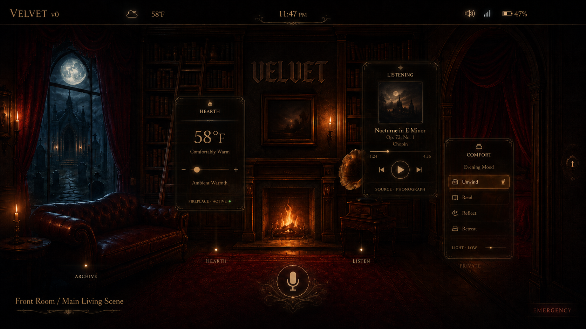

# Velvet v0 Front Room Hotspot Map

Status: Draft  
Applies To: Velvet v0 Official UI Pack  
Primary Scene: Front Room / Main Living Scene  
Target Surface: 7-inch landscape in-car display  
Base Resolution: 1920x1080 recommended

## Purpose

This document maps the first official Velvet v0 Front Room screen into buildable interaction regions.

The Front Room is image-led. It should feel like Velvet's room, not a dashboard app. Touch points are embedded into objects in the scene. Deeper controls live behind overlays, full themed scenes, control sheets, and the Backroom.

## Image Assets

Place the final images in these paths:

```text
assets/ui/velvet-v0/front-room-main.png
assets/ui/velvet-v0/front-room-touch-map.png
assets/ui/velvet-v0/front-room-overlay-demo.png
assets/ui/velvet-v0/front-room-driving-mode.png
assets/ui/velvet-v0/front-room-warning-mode.png
```

Recommended usage:

- `front-room-main.png`: clean production home scene with no large labels.
- `front-room-touch-map.png`: annotated design/reference image showing numbered touch regions.
- `front-room-overlay-demo.png`: example showing contextual cards over the room.
- `front-room-driving-mode.png`: simplified driving-state preview.
- `front-room-warning-mode.png`: warning-state preview.

Image reference once assets are committed:

```markdown

```

## Scene Role

The Front Room is the default Velvet v0 home scene.

Responsibilities:

- show Velvet's presence
- provide primary navigation
- expose object-based touch regions
- show local/offline state
- show listening/speaking state
- preserve emergency access
- preserve Backroom access
- preserve mute/silent-listening access

The Front Room may be atmospheric. It must not hide safety.

## Primary Regions

| ID | Visual Object | Primary Meaning | Tap | Hold / Deep Action | Layer Target |
|---|---|---|---|---|---|
| `audio` | Gramophone | Audio and media | Open audio quick overlay | Open full audio scene | Overlay / Full Scene |
| `climate` | Fireplace / hearth | Cabin warmth and climate | Open climate quick overlay | Open climate control sheet | Overlay / Control Sheet |
| `archive` | Bookshelf / ladder | Memory, logs, recall | Open archive preview | Open Graveyard Archive | Overlay / Full Scene |
| `lighting` | Window / moon / starlight | Lighting and night ambience | Open lighting quick overlay | Open lighting control sheet | Overlay / Control Sheet |
| `comfort` | Armchair / chaise | Seat comfort and mood presets | Open comfort quick overlay | Open comfort control sheet | Overlay / Control Sheet |
| `private` | Boudoir threshold / alcove | Owner-private comfort scene | Open private/comfort preview if allowed | Open Boudoir Comfort scene | Full Scene |
| `vehicle` | Tiburon marker / vehicle object | Vehicle status | Open vehicle summary card | Open vehicle control/status sheet | Overlay / Control Sheet |
| `conversation` | Microphone sigil / center aura | Listening and conversation | Focus voice/listening | Open conversation/status view | Front State / Overlay |
| `backroom` | Right-edge seam / keyhole | Maintenance and advanced controls | Open Backroom entry | Authenticate if required | Backroom |
| `emergency` | Emergency mark | Emergency / safety access | Open emergency panel | N/A | Emergency Panel |
| `mute` | Lower-left mute mark | Silent listening / mic mute | Toggle mute or silent listening | Open audio input status | Command / Overlay |

## Region Details

### `audio`

Visual object: Gramophone.

Purpose:

- media playback
- source selection
- playlists
- quick volume
- full audio room entry

Tap behavior:

```text
overlay:audio_quick
```

Hold behavior:

```text
scene:audio_full
```

Notes:

The gramophone is the natural media metaphor. Keep the tap region generous enough for finger use.

### `climate`

Visual object: Fireplace / hearth.

Purpose:

- cabin warmth
- target temperature
- fan quick control
- ambient climate preset

Tap behavior:

```text
overlay:climate_quick
```

Hold behavior:

```text
sheet:climate_controls
```

Notes:

The hearth is the first vertical slice candidate because it proves front scene, overlay, control sheet, and backroom depth.

### `archive`

Visual object: Bookshelf / ladder.

Purpose:

- memory
- logs
- recalls
- archive preview
- path to Graveyard Archive

Tap behavior:

```text
overlay:archive_preview
```

Hold behavior:

```text
scene:graveyard_archive
```

Notes:

The archive is not a danger path. It represents memory, continuity, old states, and retired modules.

### `lighting`

Visual object: Window, moon, starlight, or exterior glow.

Purpose:

- cabin lighting
- starlight
- night mode
- ambient exterior mood

Tap behavior:

```text
overlay:lighting_quick
```

Hold behavior:

```text
sheet:lighting_controls
```

Notes:

This region can visually bridge the library and the graveyard/archive world.

### `comfort`

Visual object: Armchair or chaise.

Purpose:

- seat comfort
- cabin mood
- comfort presets
- heat/massage quick access if installed

Tap behavior:

```text
overlay:comfort_quick
```

Hold behavior:

```text
sheet:comfort_controls
```

Notes:

Comfort controls should be available without entering private owner mode.

### `private`

Visual object: Boudoir threshold, bed alcove, curtain, or private door.

Purpose:

- owner-only comfort scene
- private mood layer
- deeper cabin comfort

Tap behavior:

```text
overlay:private_preview
```

Hold behavior:

```text
scene:boudoir_comfort
```

Access rules:

- Owner mode: allowed.
- Guest mode: hidden, locked, or replaced with a neutral comfort scene.
- Driving mode: restricted or disabled unless safe.

### `vehicle`

Visual object: Tiburon marker, small vehicle silhouette, dashboard object, or instrument detail.

Purpose:

- vehicle status
- diagnostics summary
- drive info
- module state summary

Tap behavior:

```text
overlay:vehicle_summary
```

Hold behavior:

```text
sheet:vehicle_status
```

Notes:

Dangerous vehicle actions must not be available directly from the Front Room.

### `conversation`

Visual object: Microphone sigil, center aura, Velvet mark, or listening glow.

Purpose:

- voice/listening focus
- conversation state
- speaking state
- processing state

Tap behavior:

```text
command:voice_focus
```

Hold behavior:

```text
overlay:conversation_status
```

Notes:

This region can pulse for listening and shift state for speaking or processing.

### `backroom`

Visual object: right-edge seam, keyhole, maintenance hatch, or narrow gold line.

Purpose:

- diagnostics
- maintenance
- logs
- receipts
- advanced controls
- module restart
- system truth

Tap behavior:

```text
scene:backroom_dashboard
```

Access rules:

- May require owner authentication.
- Guest mode should restrict or block technical controls.
- Emergency and warning panels may still expose required safety tools.

### `emergency`

Visual object: bottom-right emergency mark.

Purpose:

- emergency access
- safety panel
- override path

Tap behavior:

```text
panel:emergency
```

Rules:

- Must be visible or one direct gesture away.
- Must not require discovery.
- Must not be hidden only behind decoration.
- Must override normal scene behavior.

### `mute`

Visual object: lower-left mute or silent-listening mark.

Purpose:

- mute microphone
- silent listening toggle
- privacy state

Tap behavior:

```text
command:mute_toggle
```

Hold behavior:

```text
overlay:audio_input_status
```

Rules:

- State must be visibly clear.
- Guest mode may default to more conservative listening behavior.

## Draft Hotspot YAML

This is a starting geometry placeholder. Coordinates must be adjusted against the final production image.

```yaml
scene: front_room_main
base_resolution:
  width: 1920
  height: 1080

regions:
  - id: audio
    label: Gramophone / Audio
    type: polygon
    priority: normal
    action:
      tap: overlay:audio_quick
      hold: scene:audio_full
    polygon:
      - [120, 600]
      - [430, 540]
      - [520, 790]
      - [150, 860]

  - id: climate
    label: Hearth / Climate
    type: polygon
    priority: normal
    action:
      tap: overlay:climate_quick
      hold: sheet:climate_controls
    polygon:
      - [760, 470]
      - [1160, 470]
      - [1190, 780]
      - [720, 780]

  - id: archive
    label: Bookshelf / Archive
    type: polygon
    priority: normal
    action:
      tap: overlay:archive_preview
      hold: scene:graveyard_archive
    polygon:
      - [520, 180]
      - [760, 170]
      - [760, 620]
      - [500, 650]

  - id: lighting
    label: Window / Moon / Lighting
    type: polygon
    priority: normal
    action:
      tap: overlay:lighting_quick
      hold: sheet:lighting_controls
    polygon:
      - [80, 140]
      - [420, 130]
      - [440, 520]
      - [80, 540]

  - id: comfort
    label: Armchair / Comfort
    type: polygon
    priority: normal
    action:
      tap: overlay:comfort_quick
      hold: sheet:comfort_controls
    polygon:
      - [1280, 580]
      - [1560, 540]
      - [1650, 860]
      - [1240, 880]

  - id: private
    label: Boudoir Threshold
    type: polygon
    priority: owner
    action:
      tap: overlay:private_preview
      hold: scene:boudoir_comfort
    polygon:
      - [1500, 240]
      - [1860, 230]
      - [1880, 760]
      - [1540, 780]

  - id: vehicle
    label: Tiburon Vehicle Point
    type: polygon
    priority: normal
    action:
      tap: overlay:vehicle_summary
      hold: sheet:vehicle_status
    polygon:
      - [1130, 700]
      - [1320, 680]
      - [1360, 820]
      - [1120, 850]

  - id: conversation
    label: Microphone Sigil
    type: circle
    priority: high
    action:
      tap: command:voice_focus
      hold: overlay:conversation_status
    circle:
      cx: 960
      cy: 930
      radius: 110

  - id: backroom
    label: Backroom Seam
    type: edge
    priority: high
    action:
      tap: scene:backroom_dashboard
    edge: right

  - id: emergency
    label: Emergency
    type: rect
    priority: critical
    action:
      tap: panel:emergency
    rect:
      x: 1720
      y: 920
      width: 176
      height: 132

  - id: mute
    label: Mute / Silent Listening
    type: rect
    priority: high
    action:
      tap: command:mute_toggle
      hold: overlay:audio_input_status
    rect:
      x: 24
      y: 920
      width: 140
      height: 132
```

## Driving Mode Behavior

When driving mode is active:

- decorative animation should reduce
- deep private scene entry should restrict
- backroom entry may require parked state or confirmation
- critical safety overlays take priority
- voice interaction should be preferred
- overlay text should stay short
- quick controls should remain finger-friendly

Recommended allowed while moving:

- audio quick overlay
- climate quick overlay
- mute toggle
- emergency panel
- voice focus
- vehicle summary, read-only

Recommended restricted while moving:

- full archive scene
- boudoir/private scene
- deep control sheets
- backroom technical tools
- dangerous vehicle actions

## Guest Mode Behavior

When guest mode is active:

- private region should be hidden, locked, or replaced
- archive may restrict owner-specific memories
- backroom should require owner authentication
- comfort can remain available in neutral form
- emergency must remain available
- mute/privacy state should be obvious

## Implementation Notes

The Front Room scene should request actions through approved Velvet interfaces only.

Allowed:

- open overlay
- open scene
- open control sheet
- open emergency panel
- request command through approved local API/event/capability path

Not allowed:

- direct hardware control from scene art
- hidden emergency blockers
- ungated dangerous actions
- critical warnings that can be covered by decoration

## Next Steps

1. Commit the final clean Front Room image to `assets/ui/velvet-v0/front-room-main.png`.
2. Commit the annotated map to `assets/ui/velvet-v0/front-room-touch-map.png`.
3. Adjust the draft YAML coordinates against the final image.
4. Move implementation YAML into `velvet-interface` once the docs are approved.
5. Test region sizes on the actual 7-inch display.
